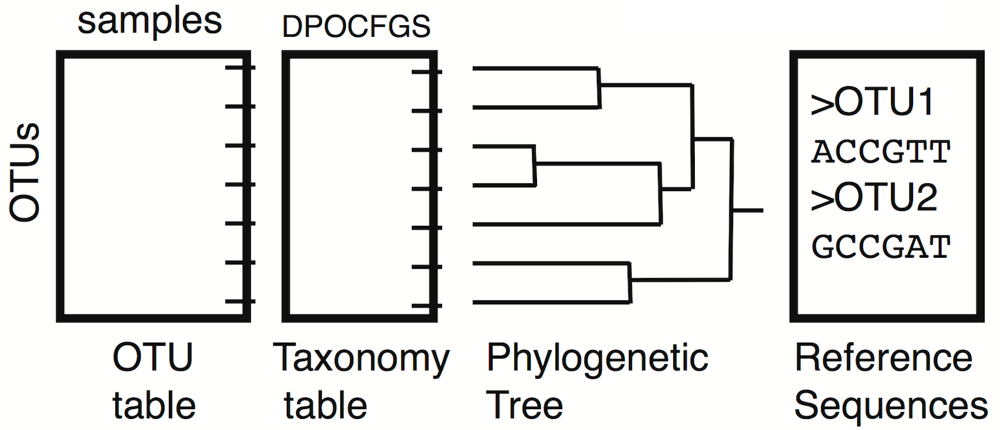

## Phyloseq

<center>
{width=640px}
</center>

## Phyloseq Benefits

- phyloseq organizes the various types of data associated with metabarcoding projects, and keeps them consistent.
- phloseq has convenient interfaces with other useful R packages (ggplot2, vegan, ape, DESeq2,...)

## Phyloseq manipulation

1. Descriptors
2. Accessors
3. Subsetting
4. Transformations

## Load phyloseq

```{r message=FALSE, warning=FALSE}
library(phyloseq)
```
For completeness, here is the version number of phyloseq used to build this instance of the tutorial -- and also how you can check your own current version from the command line.

```{r}
packageVersion("phyloseq")
```

## Load GlobalPatterns phyloseq object

Load the `GlobalPatterns` dataset, included with the phyloseq package.
```{r}
data("GlobalPatterns")
ps <- GlobalPatterns # For shorthand convenience
GlobalPatterns
```

## Descriptors

## Experiment summaries

Phyloseq offers several ways to get global summaries of the information in a metabarcoding experiment.

Number of "taxa".
```{r}
ntaxa(GlobalPatterns)
```

Number of samples.
```{r}
nsamples(GlobalPatterns)
```

Names of the taxonomic ranks.
```{r}
rank_names(GlobalPatterns)
```

The variables defined in the sample (meta)data.
```{r}
sample_variables(GlobalPatterns)
```

The output when printing the object also contains most of these summaries.

## Names

The names of each sample and each "taxa" can be accessed from a phyloseq object, and changed as well.

```{r}
sample_names(GlobalPatterns)[1:5]
taxa_names(GlobalPatterns)[1:10]
```

In general, numbers make for bad names as they can get automatically and unexpectedly converted from strings to numbers, at which point they stop acting as names and start acting as indices. We will rename these taxa.

```{r}
## Easy way
#taxa_names(GlobalPatterns) <- paste("OTU", taxa_names(GlobalPatterns), sep="_")
## Robust way
taxa_names(GlobalPatterns) <- paste("OTU", gsub("^OTU_", "", taxa_names(GlobalPatterns)), sep="_")
taxa_names(GlobalPatterns)[1:10]
```

## Sample Abundances

One of the first things it is useful to look at is the distribution of abundances (or library sizes) of each sample.

```{r}
sample_sums(GlobalPatterns)
```

Typically it is more useful to see this in a graphical form.

```{r}
plot(sample_sums(GlobalPatterns))
```

I often prefer the sorted view:
```{r}
plot(sort(sample_sums(GlobalPatterns)))
```

## Taxa Abundances

A similar function exists for exploring the abundances of each "taxa".

```{r}
taxa_sums(GlobalPatterns)[1:10]
summary(taxa_sums(GlobalPatterns))
```

Plotting taxonomic abundances on a log-scale is often useful.
```{r}
sorted.sums <- sort(taxa_sums(GlobalPatterns), decreasing=TRUE)
plot(sorted.sums, log="y", ylab="Abundance")
```

Another useful metric is the cumulative amount of all reads in the top XX taxa.

```{r}
plot(cumsum((sorted.sums))/sum(sorted.sums))
abline(0.5, 0, col="red")
abline(0.9, 0, col="red")
abline(0.99, 0, col="red")
```

## Accessors: "OTU" table

Components of a phyloseq object, like the OTU Table, can be accessed by special accessor functions, or ``accessors'', which return specific information about the phylogenetic sequencing data, if present. These accessor functions are available for direct interaction by users and dependent functions/packages.

```{r gp-sample-names}
otu_table(GlobalPatterns)[1:5, 1:5]
```

It is often useful to wrap these accessors in functions coercing them back into standard R objects.

```{r}
otu_mat <- function(ps) as(otu_table(ps), "matrix")
otu_mat(GlobalPatterns)[1:5, 1:5]
```

## Accessors: Sample (Meta)data

We can also pull out the sampe metadata and work with it directly.

```{r}
sample_df <- function(ps) as(sample_data(ps), "data.frame")
head(sample_df(GlobalPatterns))
```

We can then index into this just like a regular `data.frame`.

```{r}
sample_df(GlobalPatterns)$SampleType
```

## Accessors: Taxonomy table and phylogenetic tree

Similar methods exist for the other two slots in a phyloseq object.

```{r}
tax_mat <- function(ps) as(tax_table(ps), "matrix")
tax_mat(GlobalPatterns)[1:5, ]
```

```{r}
tre <- phy_tree(GlobalPatterns)
tre
```

## Accessors: Assignment

These accessor objects not only allow you to extract data from a phyloseq object, they also allow you to assign data to a phyloseq object. This is most often useful for the sample metadata, as you add more columns generated by additional analyses.

```{r}
# Assign the full sample_data
samdf <- sample_df(GlobalPatterns)
samdf$LibrarySize <- sample_sums(GlobalPatterns)
sample_data(GlobalPatterns) <- sample_data(samdf)
# The shorthand way, assign one column
sample_data(GlobalPatterns)$LibrarySize <- sample_sums(GlobalPatterns)
head(sample_df(GlobalPatterns))
```

You can do similar things with the `otu_table` and `tax_table` and `phy_tree` slots.

## Subsetting: Samples

The key functions here are `subset_samples` and `prune_samples`.

`subset_samples` is based on the `subset` function from the data.table package, and allows you to specify a subsetting expression based on the sample variables.

```{r}
nsamples(GlobalPatterns)
foo <- subset_samples(GlobalPatterns, LibrarySize > 1000000)
nsamples(foo)
foo <- subset_samples(GlobalPatterns, LibrarySize > 1000000 & SampleType=="Soil")
nsamples(foo)
```

Just 1 soil sample with >1M reads.

`prune_samples` is based on the user providing either the names of samples they want to *keep*, or a logical vector indicating (with TRUE) the samples they want to *keep*.

```{r}
foo <- prune_samples(sample_sums(GlobalPatterns) > 1000000, GlobalPatterns)
nsamples(foo)
```

Both can be used to achieve the same thing. Use whichever is more convenient. Note that these functions keep everything *consistent*, that is they subset or prune samples from both the `otu_table` and the `sample_data` in the same way.

## Subsetting: Taxa

The key functions here are `subset_taxa` and `prune_taxa`. Their operation is exactly analogous to the `_samples` functions, with the difference being that the `tax_table` replaces the `sample_data` for the operatin of `subset_taxa`.

```{r}
ntaxa(GlobalPatterns)
foo <- subset_taxa(GlobalPatterns, Phylum == "Bacteroidetes")
ntaxa(foo)
foo <- prune_taxa(tax_mat(GlobalPatterns)[,"Phylum"] == "Bacteroidetes" & taxa_sums(GlobalPatterns) > 100, GlobalPatterns)
ntaxa(foo)
```

`prune_taxa` is more widely useful, because `subset_taxa` is limited to operations using the taxonomic classifications. Note that these functions keep everything *consistent*, that is they subset or prune taxa from the `otu_table`, `tax_table` and `phy_tree` in the same way.

## Subsetting: Taxa Example

Here is an example of how one can inspect the phylogenetic tree of the 10 most abundant taxa in the dataset.

```{r}
top10.taxa = names(sort(taxa_sums(GlobalPatterns), decreasing = TRUE)[1:10])
ex1 = prune_taxa(top10.taxa, GlobalPatterns)
plot(phy_tree(ex1), show.node.label = TRUE)
plot_tree(ex1, color = "SampleType", label.tips = "Phylum", ladderize = "left", justify = "left" , size = "Abundance")
```

## Transformations: Abundances

One of the key statistical techniques for analyzing metabarcoding survey data (or any data) are data transformations. For example, one of the most common such transformations that is performed is to convert count data (e.g. of read) to proportions by dividing by the total number of reads in each sample. This functionality, in general form, is provided by the `transform_sample_counts` function.

Transform to proportions.
```{r GP-filter, cache=TRUE}
GPr <- transform_sample_counts(GlobalPatterns, function(x) x / sum(x) )
# The function provided is applied to the vector of counts from each sample
```

Many other transformations are possible, for example the regularized log count.
```{r}
GPrlog <- transform_sample_counts(GlobalPatterns, function(x) log(1 + x) )
# rarefy_even_depth(...) can be used for the rarefaction approach.
```

There is much discussion on the right ways to normalized metabarcoding data. See for example the ["Waste Not, Want Not paper..."" by McMurdie and Holmes]( https://doi.org/10.1371/journal.pcbi.1003531), or ["Normalization...strategies depend upon data characteristics" by Weiss et al](https://doi.org/10.1186/s40168-017-0237-y).

## Transformations: Taxa

The phyloseq-package includes the agglomeration functions, `tip_glom` and `tax_glom`, for merging all OTUs in an experiment that are similar beyond a phylogenetic or taxonomic threshold, respectively. The following code demonstrates how to agglomerate the "Bacteroidetes-only" dataset (called `gpsfb`) at the taxonomic rank of Family, and create an annotated tree of the result.

```{r tip-glom-tree-supp-intext, echo=TRUE, eval=FALSE}
GPb <- subset_taxa(GlobalPatterns, Phylum=="Bacteroidetes")
GPb.fam = tax_glom(GPb, "Family")
plot_tree(GPb.fam, color="SampleType", label.tips = "Family")
```

## Phyloseq manipulations

As you start chaining the subsetting, accessors, and transformations together, you can start doing some very powerful things, while letting phyloseq take care of the problem of keeping the different data types from your metabarcoding consistent with one another!

I suggest allowing yourself to explore [the phyloseq website](https://joey711.github.io/phyloseq/) for a bounty of documentation and example workflows.
