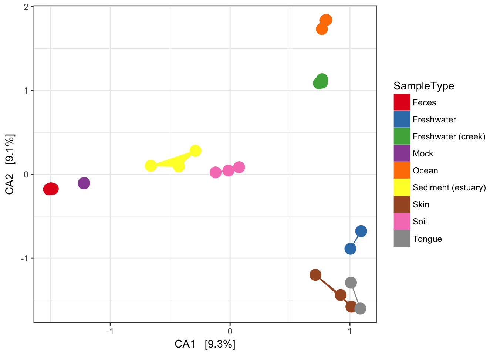

## Phyloseq: Distances and Ordination
<center>
`distance` + `ordinate` + `plot_ordination` =

{width=640px}
</center>

## The `distance` function

The `distance` function implements a wide varity of community distance and dissimilarity metrics.

```{r}
library(phyloseq); packageVersion("phyloseq")
unlist(distanceMethodList)
```

For the most part these are implemented in other packages, especially vegan via `vegdist` and `betadiver` functions, but a few important ones are implemented directly in phyloseq, including the unifrac distances and DPCoA.

Note: Other packages also define functions named `distance`, so sometimes it is best to specify the phyloseq one specifically by `phyloseq::distance`.

## The `distance` function

When you call the `distance` function, it will calculate the community distances/dissimilarities between all samples in the phyloseq object.

```{r}
data(GlobalPatterns); GP <- GlobalPatterns # for shorthand
GP5 <- prune_samples(sample_names(GP)[1:5], GP)
dist5 <- distance(GP5, method="jsd")
dist5
```

The standard object returned is of class `"dist"`, but can also be converted into a (symmetric) matrix.

```{r}
as(dist5, "matrix")
```

## The `ordinate` function

The `ordinate` function implements several methods to convert a set of community distances/dissimilarities into a reduced dimentionsal representation.

Supported methods include: `c("DCA", "CCA", "RDA", "CAP", "DPCoA", "NMDS", "MDS", "PCoA")`, with `"NMDS"` (non-metric multi-dimenstional scaling) and `"MDS"` (multidimensional scaling) being probably the most commonly used in practice.

```{r}
ord5 <- ordinate(GP5, method="MDS", distance=dist5)
ord5
```

There is also a shorthand in which you directly specify the distance method, rather than precomputing it.

```{r}
ord5.short <- ordinate(GP5, method="MDS", distance="jsd")
identical(ord5, ord5.short)
```

## The `ordinate` function: Dimensionality

Roughly speaking, the `$Eigenvalues` list the importance of each dimension in explaining the total set of distances, and it is often worth performing a scree plot to get a sense of the dimensionality of the data.

```{r}
plot_scree(ord5)
```

Here we see that the first dimension explains much of the data, and the second some, while the 3rd/4th dimensions contribute very little. This gives us a qualitative sense of the dimensional complexity of the distance/dissimilarity relationships, and is often worth inspecting.

## The `plot_ordination` function

In the end, we want those pretty graphics. The function to do that is the `plot_ordination` function, which produces ggplot2 graphics (which are then infinitely further modifiable via ggplot2). `plot_ordination` requires a phyloseq object, and an ordination that was produces from that object. It also allows simple assignment of color, shape, label and size to sample variables.

```{r}
ord <- ordinate(GP, method="MDS", distance="jsd")
plot_ordination(GP, ord, color="SampleType")
```

Much more information is available from `?plot_ordination` and also through [the `plot_ordination` tutorial on the phyloseq web site](https://joey711.github.io/phyloseq/plot_ordination-examples.html).
